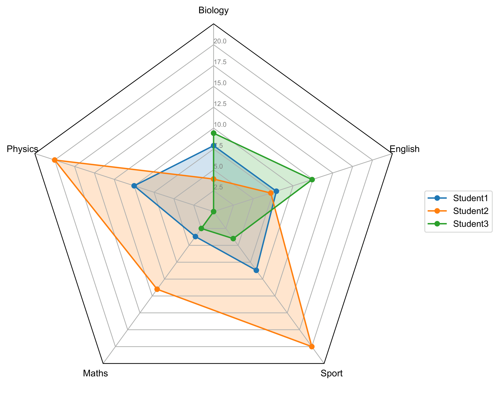
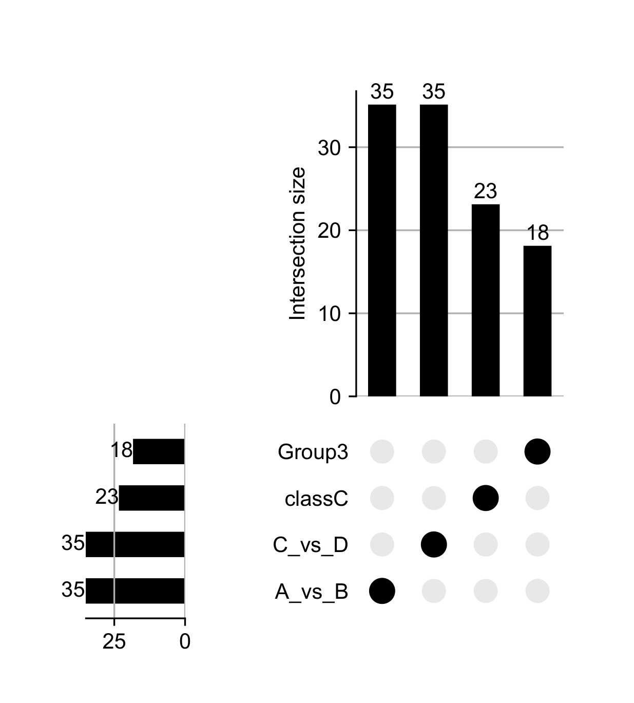
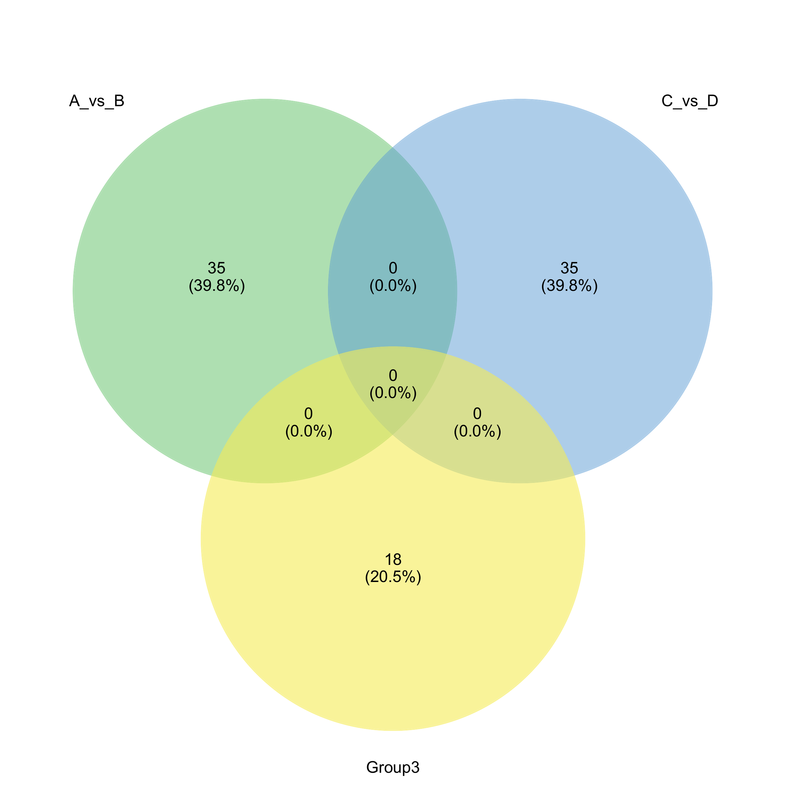
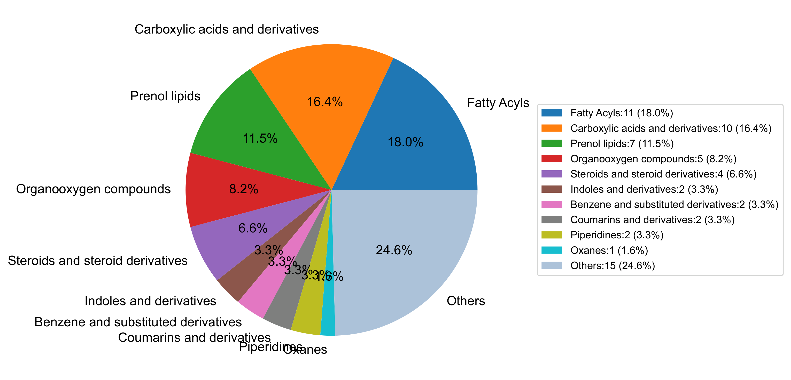
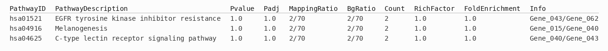
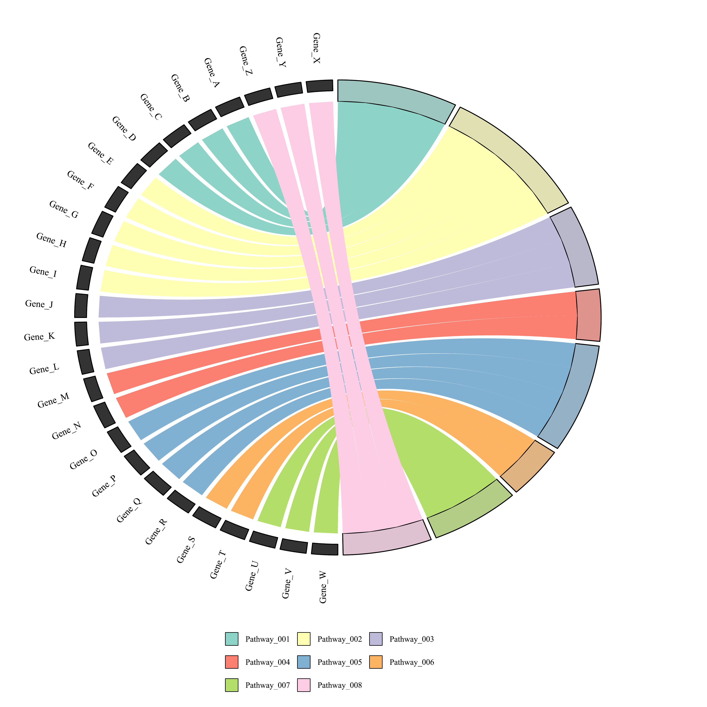
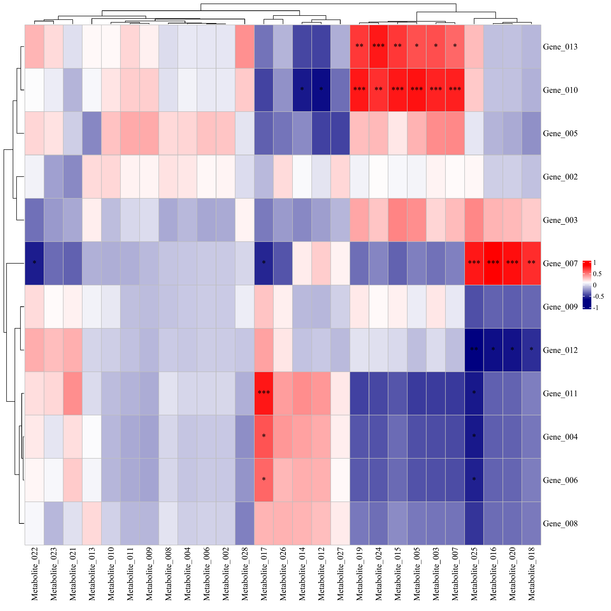
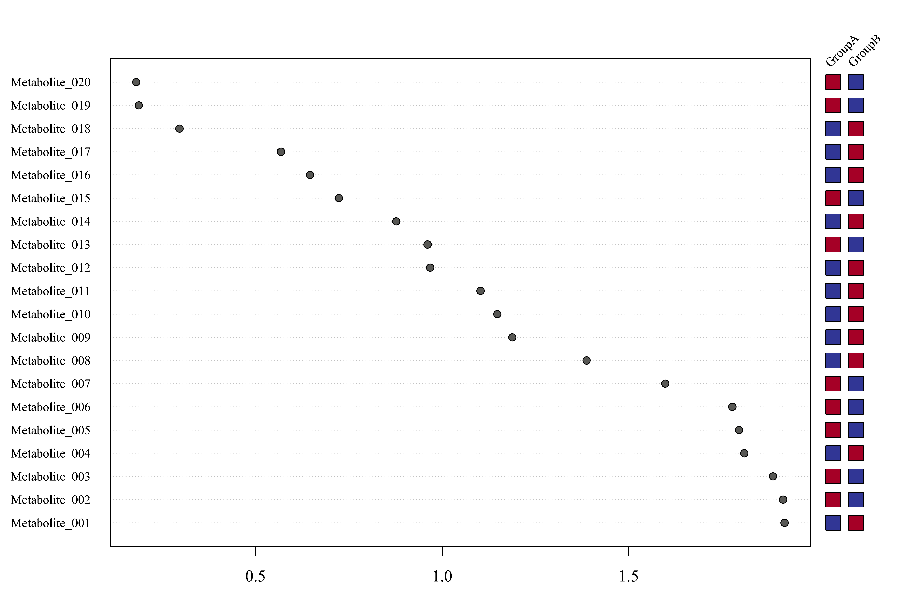
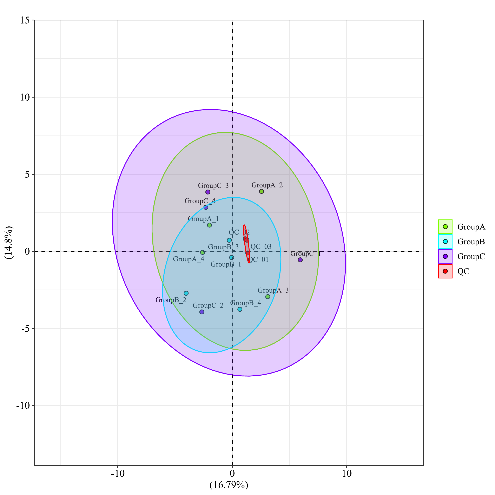

# biodraw-skills

生信绘图 Skill,通过自然语言即可驱动 Python / R 绘图脚本,生成常见的生物信息学统计结果图/表.

## 支持的图表类型

| 类型 | 语言 | 说明 | 示例 |
|------|------|------|------|
| `radar` | Python | 雷达图,支持多边形 / 圆形 |  |
| `upset` | Python | UpSet 图,多集合交集可视化 |  |
| `venn` | Python | Venn 图,1–6 组 |  |
| `pie` | Python | 饼图 / 环形图,支持 TopN |  |
| `enrichora` | Python | 富集分析(ORA),输出通路表格 |  |
| `enrichcircos` | R | 富集分析弦图(Chord),通路–基因关联 |  |
| `heatmap.cor.double` | R | 双组学联合相关性热图 |  |
| `heatmapvip` | R | VIP 棒棒糖热图(PLS-DA / OPLS-DA) |  |
| `pcam1` | R | PCA 分析图(FactoMineR,2D / 3D) |  |

## 项目结构

```
biodraw-skills/
├── skills/
│   ├── SKILL.md                    # Skill 主入口
│   ├── assets/
│   │   └── testdata/               # 各图表内置示例数据
│   └── scripts/
│       ├── <type>.py / <type>.R    # 各图表绘图脚本
│       ├── <type>.md               # 各图表参数说明 (供 Skill 读取)
│       ├── <type>.requirements.txt # 各图表依赖清单
│       ├── check_deps.py           # Python/R 依赖检查 / 安装工具
│       ├── init_renv.R             # R 依赖安装工具 (基于 renv)
│       ├── utils.py                # Python 公共工具
│       └── utils.R                 # R 公共工具
└── README.md
```

## 安装

> 目前仅在 **Claude Code** 上测试过.

**前置条件：**
- Python 3 (Python 类图表)

- R + `renv` 包(R 类图表,可选): `install.packages("renv")`

- p.s 绘图脚本包的Python 和 R 依赖无需手动安装,首次使用某类图表时 Skill 会自动检测并提示安装.

**1. 克隆仓库**

```bash
git clone https://github.com/sosyphe/biodraw-skills.git
```

**2. 把Skill注册到 Claude Code**

```bash
mkdir -p ~/.claude/skills/biodraw
# 方式 A：软链接(推荐,改动实时生效)
ln -s biodraw-skills/skills ~/.claude/skills/biodraw
# 方式 B：复制
cp -r biodraw-skills/skills ~/.claude/skills/biodraw
```

Claude Code 会自动读取 `~/.claude/skills/biodraw/SKILL.md`,无需额外配置.


## 使用方式

**方式一：命令触发**

输入 /biodraw`,Skill 会列出所有可用图表类型,选择后按提示操作.

**方式二：自然语言触发**

直接描述需求,Skill 自动识别图表类型,例如：

> 画一个雷达图 / 帮我做 Venn 图 / PCA 分析 / 相关性热图 / UpSet 图

两种方式均会通过问答引导确认数据文件、输出目录和外观参数,自动安装缺失依赖,最终输出 PDF + PNG 到指定目录.
所有图表均内置示例数据,无需准备数据即可快速试用.

